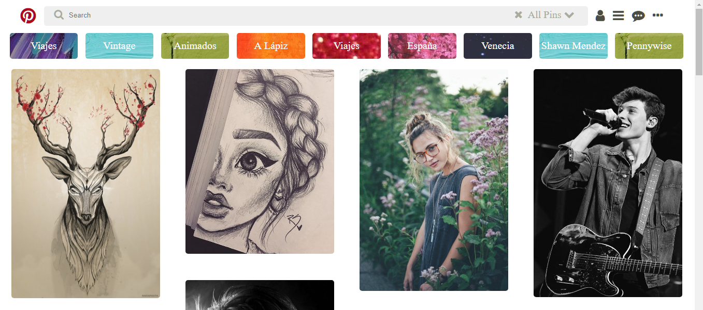

## **PINTEREST**

### **OBJETIVO**
#### Recrear la maquetización de la página web Pinterest haciendo uso de las distintas herramientas que ofrecen tanto HTML como CSS. 

### **DETALLES DEL REPOSITORIO**
* #### Se encuentra un archivo *index.html* el cual contiene la estructura del proyecto.
* #### En la carpeta *CSS* se encuentra el archivo *main.css* el cual contiene todos los estilos utilizados en nuestro proyecto.
* #### Detro de la carpeta *assets/icons*  se encuentran descargada desde [Font-Awesome](http://fontawesome.io/ "titulo") la carpeta que contiene a los iconos que utilizamos en el proyecto.
* #### Por último la carpeta assets/images contine todos las imágenes utilizadas para la recreación de la web y fondos de diseño para ciertas etiquetas.

### **Bugs**
#### Puede que no se visualice de manera correcta el orden de los distintos elementos de la web ya que por el momento no es *desing reponsive*(adaptable a distintos dispositivos). La visualización dependerá de la pantalla del navegador o el dispositivo.
